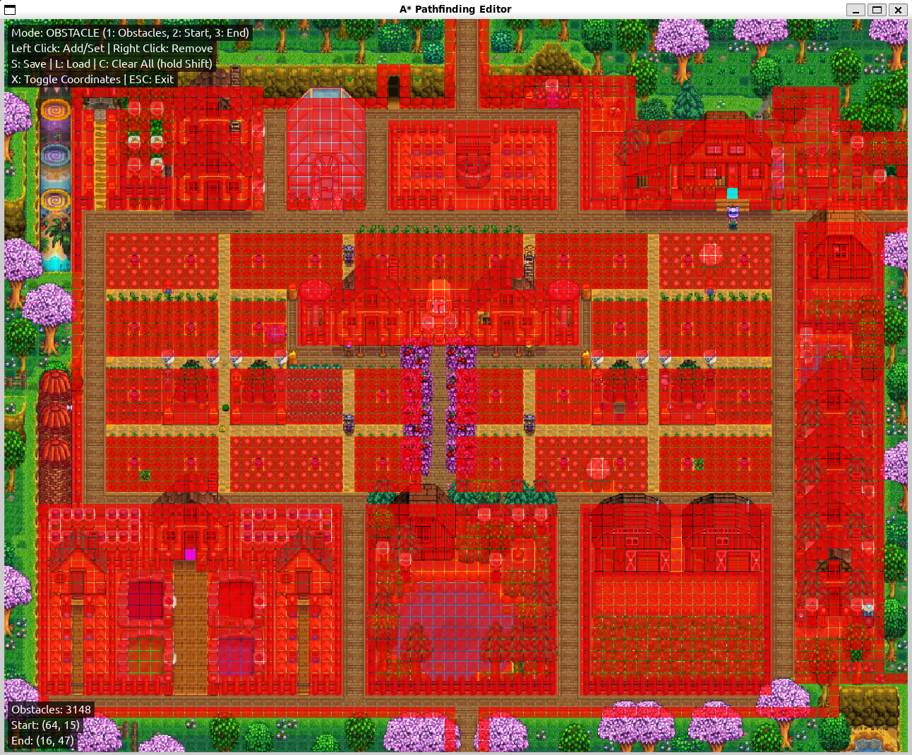

# A* Pathfinding Visualization in Stardew Valley 

<p align="justify">
A real-time visualization of the A* algorithm to find the optimal path between two points on a Stardew Valley farm. This project features an interactive editor for creating custom maps with obstacles and configurable start/end points.
</p>

<p align="justify">
Originally built as a class project for Artificial and Computational Intelligence I, then optimized and enhanced with better data structures, cleaner architecture and improved performance.
</p>


## Installation

```bash
pip install -r requirements.txt
python editor.py  # Edit obstacles and set start/end points
python main.py    # Run visualization
```

## Project Structure

```
.
├── main.py              # A* visualization
├── editor.py            # Map editor
├── data/
│   ├── farm.png         # Background image
│   ├── obstacles.txt    # Obstacle coordinates
│   └── points.txt       # Start/end points
└── requirements.txt
```

## Usage

### Editor



- **1/2/3**: Switch between Obstacle/Start/End mode
- **Left Click**: Add obstacle or set point
- **Right Click**: Remove obstacle
- **S**: Save, **L**: Load, **Shift+C**: Clear all
- **X**: Toggle coordinates

## Import Your Own Stardew Farm

1. Go to [Stardew Planner V3](https://stardew.info/)
2. Import your save file
3. Save as image
4. Replace `data/farm.png` with your own image

---

<sub>**License:** MIT © 2025 Lucas Cogrossi</sub>
